

# Next.js

### 1. Next.js vs React
**React(Vite/CRA):**
* Executa no navegador (client)
* Serve páginas que são populadas pelo JavaScript
* Pode impactar negativamente o SEO
* Depende de plugins (react-router)
* Deploy pode ser feito em qualquer hospedagem

**Next.js:**
* Executa no navegador (client) e no servidor (server)
* Serve páginas já renderizadas no servidor (SSR)
* Pode melhorar o SEO e o carregamento inicial
* Tenta ser uma solução completa (rotas, API, etc)
* É um framework, logo te dá mais regras
* Deploy deve ser feito em um servidor Node.js (ex: Vercel)
* Bugs, mudanças e atualizações

Fetch React 18 (Vite/CRA):

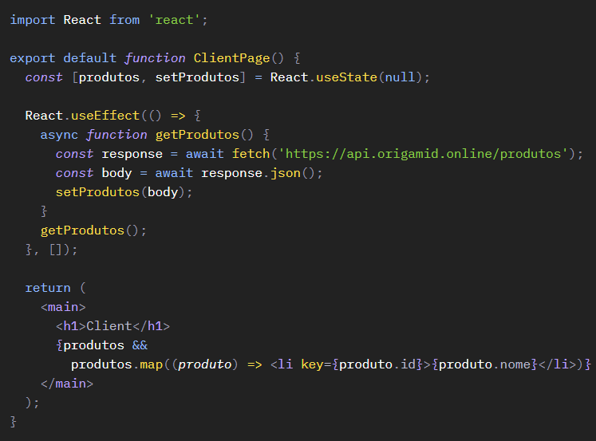

Fetch Next.js 14:

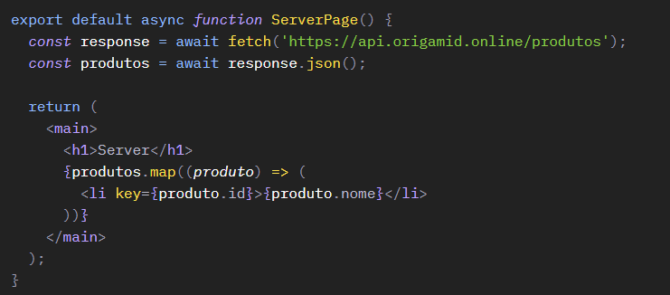
_No Next, o componente de RTeact pode ser assíncrono, com isso, pode-se utilizar diretamente o await_

#### 1.1. Renderizações:

No _Next.js_, a renderização pode ocorrer no lado do servidor (Server Side Rendering - SSR), onde o HTML é gerado no servidor e enviado para o cliente, resultando em tempos de carregamento mais rápidos e melhorando o SEO. Além disso, o Next.js oferece suporte para geração estática (Static Site Generation - SSG) e pré-renderização no momento da construção (build time), o que permite que páginas sejam geradas antecipadamente e armazenadas em cache, reduzindo a necessidade de gerar a página a cada requisição.

Por outro lado, no _React_ puro, geralmente é adotada a renderização no lado do cliente (Client Side Rendering - CSR) por padrão. Nesse caso, o JavaScript é executado no navegador do cliente, e as mudanças de estado são aplicadas diretamente no DOM. Embora isso não exija uma requisição ao servidor para renderizar a página inicialmente, interações posteriores podem exigir comunicação com o servidor para buscar ou enviar dados. Essa abordagem pode resultar em uma experiência mais interativa para o usuário, mas pode ter um impacto inicial no tempo de carregamento da página, especialmente em aplicações grandes.

### 2. App Router
**Arquivos = Rotas**

No Next.js, cada arquivo _page.tsx_ dentro da pasta app é uma rota. O arquivo _app/page.tsx_ é a rota _/_ e o arquivo _app/sobre/page.tsx_ é a rota _/sobre_.

#### 2.1. layout.tsx
O arquivo _layout.tsx_ é o layout padrão de todas as páginas. Ele é importado automaticamente pelo Next.js e pode ser usado para adicionar elementos que se repetem em todas as páginas, como a navegação.

Na raiz ele é necessário para adicionar o html e o body. Porém nas demais rotas ele é opcional.

#### 2.1.1 metadata
Exportar um objeto const metadata, irá adicionar as meta tags na página. Pode ser exportado de qualquer arquivo de rota, como page.tsx ou layout.tsx.

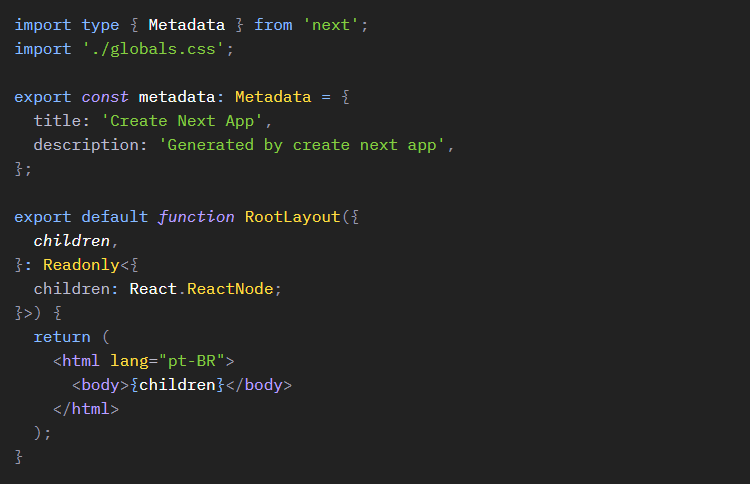

#### 2.2. App Router e Pages Router
Existe também um sistema de rotas chamado Pages Router, que era o padrão do Next.js antes da versão 13. Hoje em dia é recomendado usar o **App Router**.

### 3. Componentes
Componentes podem ser criados e importados da mesma forma que usamos no React. No next podemos utilizar o _@_ como atalho para a pasta _src_.

### 4. Link
O Next.js possui o componente Link que permite a navegação entre páginas sem que a página seja recarregada (client side).

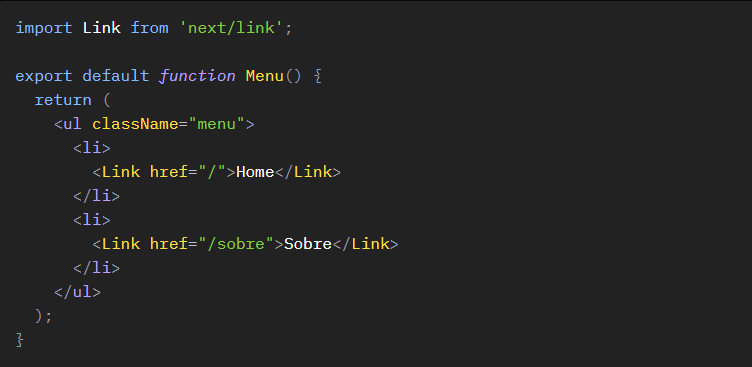

#### 4.1. Prefetch
O Link automaticamente faz o prefetch de páginas estáticas, ou seja, o Next.js já carrega a página em segundo plano para que ela esteja disponível quando o usuário clicar no link. (true é o padrão)

O comportamento do prefetch só é possível ser analisado em produção (aba network).

_npm run build_ + _npm run start_

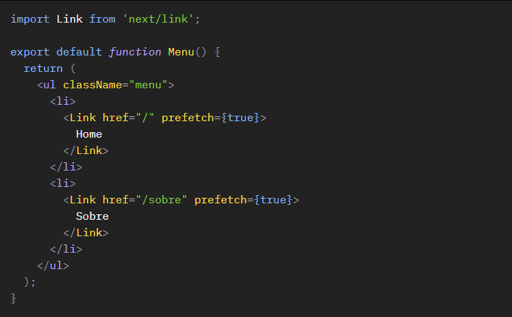
 
#### 4.2. Link Interno e Scroll
O comportamento de scroll interno funciona da mesma forma que o <a>. É possível desabilitar o scroll automático com scroll={false}.

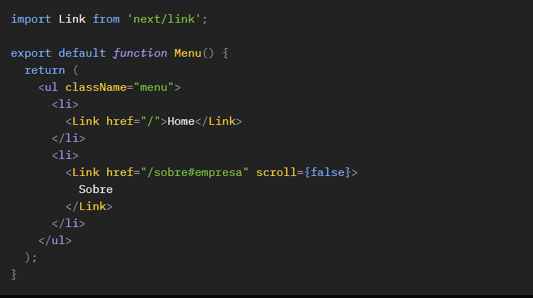

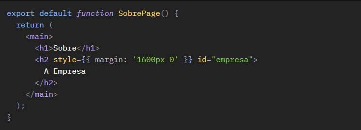

### 5. Server e Client Components

#### 5.1. Server Components
Possuem acesso a API do servidor (Node) como o fs, path, e outras implementadas pelo Next.js como o fetch e cookies. Renderizam no servidor.
Por padrão, todos os componentes são Server Components.

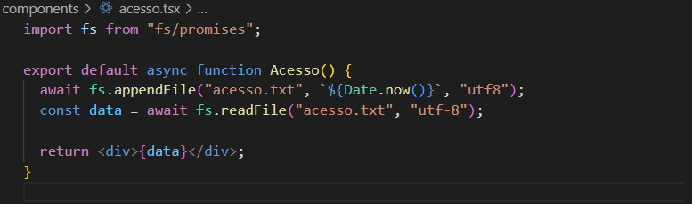

#### 5.2. Client Components
Possui acesso as APIs web como window e document, bem como as APIs do Next.js e do React, como useState e useEffect. Continuam sendo pré-renderizados no servidor, mas são "hidratados" (Hydration) no cliente.

Para definir um componente como Client Component, basta adicionar 'use client' na primeira linha do componente.

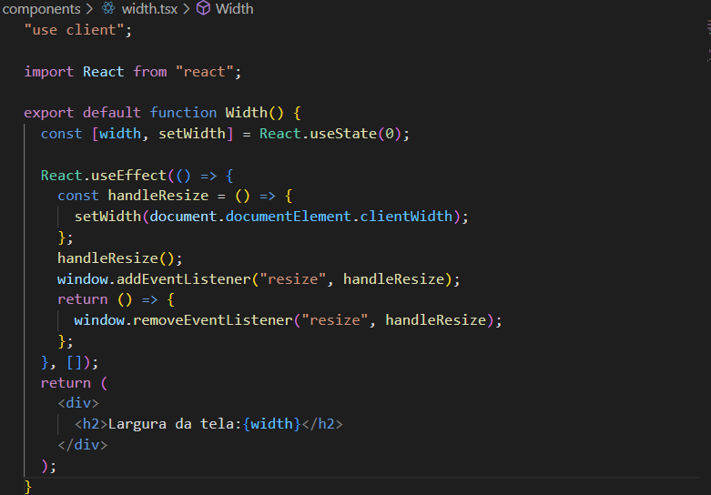

#### 5.3. Nested Components
Server Components podem conter Client e Server Components, mas Client Components não podem conter Server Components.

Evite definir páginas (page.tsx) como Client Components, mantenha elas sempre como Server Components, assim elas podem receber Server e Client Components.

#### 5.4. Pré-renderização
Client Components são pré-renderizados no servidor, durante a pré-renderização, não temos acesso a APIs web como window e document. Por isso erros como document is not defined podem ocorrer.

Se o código estiver dentro do useEffect, ele só será ativado no cliente (será hidratado depois, a chamada hydration), por isso não teremos problemas. Mas códigos fora do useEffect podem causar erros.
__Caso tenha algum componente no qual haja a necessidade de ter acesso à api Web fora do useEffect. é possível carregar esse componente de forma dinâmica e disabilitar a pré renderização através do next/dynamic:_

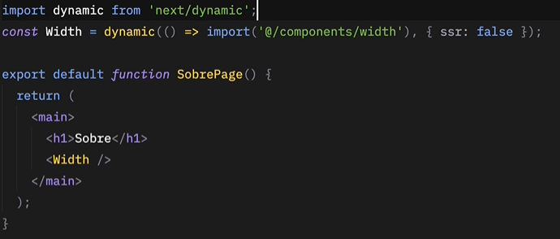

### 6. Fetch
#### 6.1. Server Fetch
Server Components podem ser definidos como funções assíncronas, assim podemos fazer o fetch de dados no servidor e retornar o componente com os dados já disponíveis.

Se você estiver criando uma aplicação Full-Stack, você pode também acessar o banco de dados diretamente no componente.
_Obs: o console.log() em um server component, aparece no terminal e não no browser._
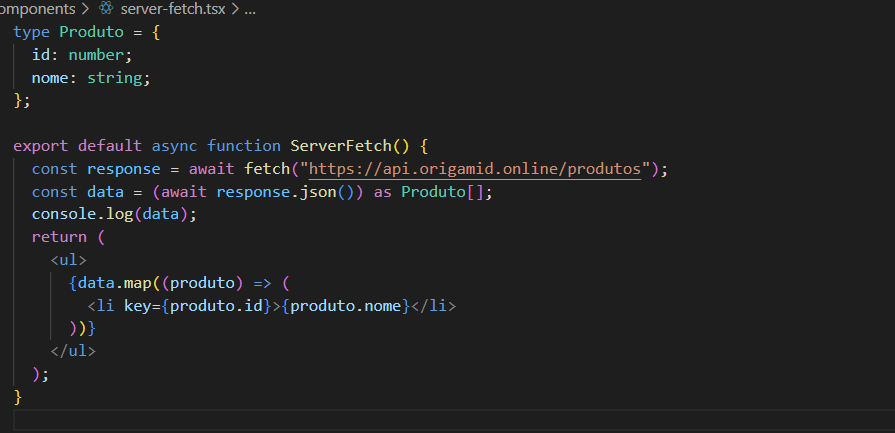

#### 6.2. Client Fetch
Podemos ainda fazer o fetch de dados no client, utilizando o useEffect e useState. Porém esses dados não serão pré-renderizados no servidor.

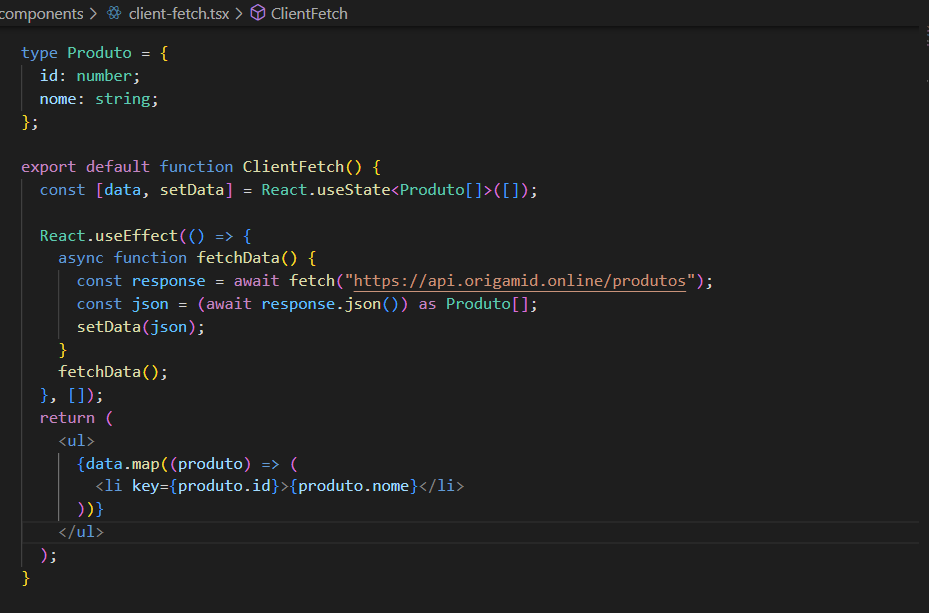